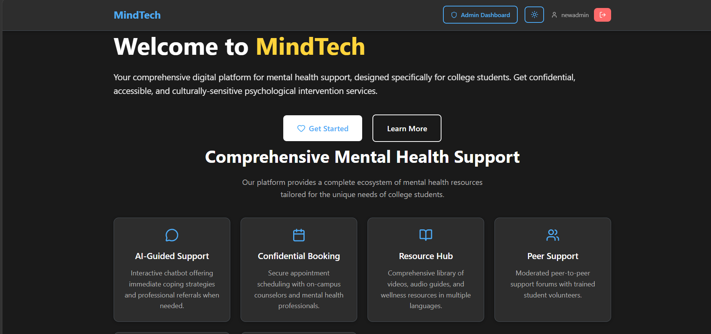
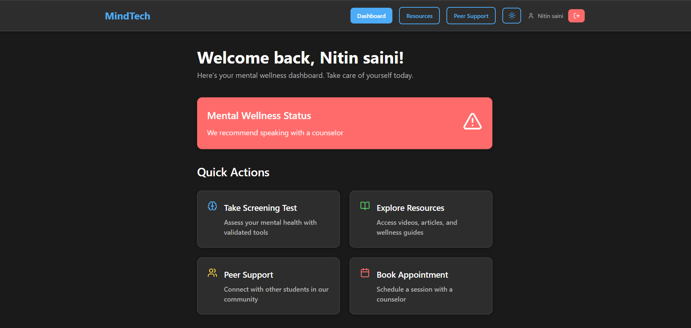
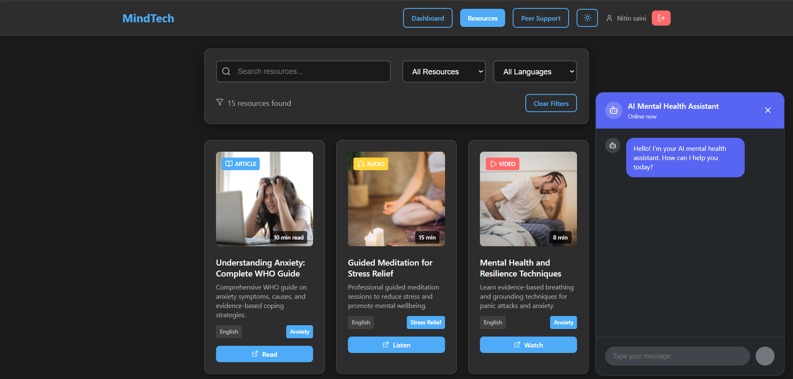
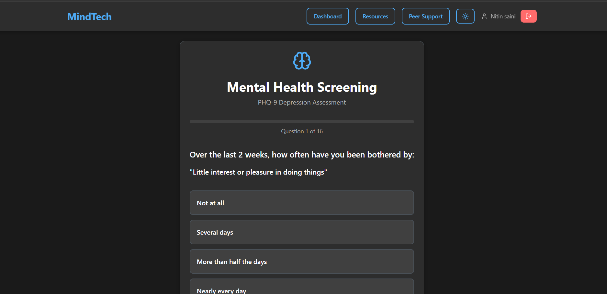
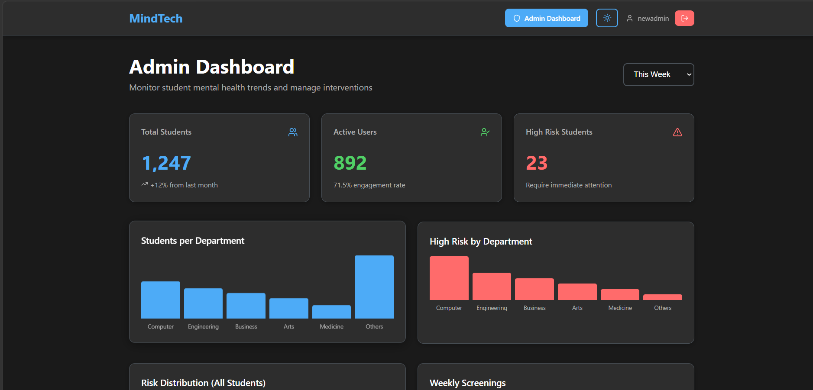
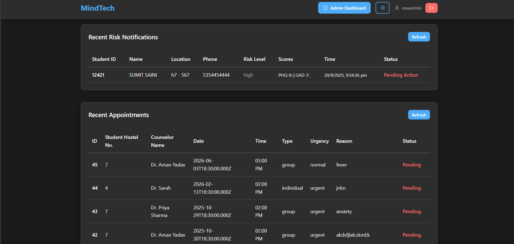

#  MindCare — Student Mental Health Support Platform

MindCare is a full-stack AI-powered mental health support platform designed to help students identify stress, anxiety, and depression risks early and access personalized support in a safe, private, and stigma-free environment.

It combines **clinically validated screening tools, chatbot support, personalized resource recommendations, and smart admin escalation** to support early mental health intervention for students.

---

##  Features

### 🧾 Standardized Mental Health Screening

A structured assessment system that helps students evaluate their mental health condition using validated screening tools.

#### Key Capabilities
- PHQ-9 assessment for depression screening
- GAD-7 assessment for anxiety screening
- Automated risk categorization
- Risk levels: Normal, Mild, Moderate, Severe
- Test score-based mental health insights
- Student test history tracking

#### Approach
- Students answer clinically structured questions.
- Scores are calculated automatically.
- Risk category is assigned based on score range.
- Results are used for personalized recommendations.
- High-risk cases can trigger admin alerts for early intervention.

---


### Personalized Resource Recommendations

A recommendation system that suggests helpful mental health resources based on student assessment scores and chatbot interactions.

#### Features
- Personalized articles
- Self-help resources
- Stress management content
- Coping technique recommendations
- Awareness and guidance material
- Resources based on depression and anxiety risk levels

#### Recommendation Inputs
- PHQ-9 score
- GAD-7 score
- Chatbot conversation context
- Mental health risk category
- Student interaction history

---

###  Smart Escalation & Admin Alerts

A privacy-first escalation system that alerts admins only when a student is detected as high-risk.

#### Key Capabilities
- Student data shared with admin only in high-risk cases
- Admin alerts for severe risk levels
- Early-warning system for institutions
- Admin dashboard for flagged cases
- Risk summaries and monitoring support
- Helps institutions identify students who may need timely support

#### Privacy Approach
Student interactions remain private by default. Admin visibility is triggered only when the system detects a high-risk case that may require early intervention.

---

###  Role-Based Dashboards

MindCare provides separate dashboards for students and admins.

#### Student Dashboard
- Take PHQ-9 and GAD-7 tests
- View mental health risk category
- Access personalized resources
- Track previous test results
- Receive supportive guidance

#### Admin Dashboard
- View high-risk student alerts
- Monitor flagged cases
- Analyze risk summaries
- Access institutional mental health insights
- Support early intervention workflows

---

##  Why This Matters

Students often face academic pressure, digital burnout, stress, anxiety, and emotional challenges, but many avoid seeking help due to stigma, fear of judgment, or lack of awareness.

MindCare solves this by providing:

- Early identification of mental health risks
- Private and judgment-free student support
- Guidance for stress and emotional well-being
- Scalable support for educational institutions
- Smart escalation for high-risk cases
- A privacy-first mental health support system

---

##  Tech Stack

| Category | Tools / Technologies |
|---|---|
| Frontend | React.js, Vite, Tailwind CSS |
| Backend |  Node.js, Express.js, REST APIs |
| Database | MySQL |
| Tools | Git, GitHub, Postman, VS Code |

---

##  Screenshots

### Landing Page


### Student Dashboard


### Resources


### Mental Health Test


### Admin Dashboard 1





---

## 🏗️ System Architecture

```txt
Student Input
   ↓
React Frontend
   ↓
Backend APIs
   ↓
├── Mental Health Screening
│   ├── PHQ-9 Assessment
│   ├── GAD-7 Assessment
│   ├── Score Calculation
│   ├── Risk Categorization
│   └── Result Storage
│
├── Chatbot
│   ├── Student Query
│   ├── Gemini API Integration
│   ├── Document-Grounded Response
│   └── Mental Health Resource Lookup
│
├── Resource Recommendation System
│   ├── Test Score Analysis
│   ├── Chat Context Analysis
│   ├── Risk-Level Mapping
│   └── Personalized Resources
│
└── Admin Escalation System
    ├── High-Risk Case Detection
    ├── Admin Alerts
    ├── Risk Summary
    └── Flagged Student Monitoring
```

---

## 📁 Project Structure

## 📁 Project Structure

```txt
MindCare/
├── backend/                  # Backend server
│   ├── __pycache__/           # Python cache files
│   ├── config/                # Configuration files
│   ├── controllers/           # Business logic / controller functions
│   ├── data/                  # Data files / knowledge base content
│   ├── model/                 # ML / AI models or model-related files
│   ├── routes/                # API routes
│   ├── utils/                 # Helper and utility functions
│   ├── app.py                 # Flask app entry point
│   ├── index.js               # Node.js / Express server entry point
│   ├── listModels.js          # Script for listing available AI models
│   ├── testGemini.js          # Gemini API testing script
│   ├── package.json           # Backend Node dependencies
│   └── package-lock.json      # Backend dependency lock file
│
├── public/                   # Public static files
│   └── vite.svg
│
├── src/                      # React + Vite frontend source
│   ├── assets/                # Images and static assets
│   ├── components/            # Reusable UI components
│   ├── contexts/              # React context files
│   ├── pages/                 # Application pages
│   ├── App.css                # App-level styling
│   ├── App.jsx                # Main React component
│   ├── index.css              # Global CSS
│   └── main.jsx               # React entry point
│
├── .gitignore                # Git ignored files
├── README.md                 # Project documentation
├── eslint.config.js          # ESLint configuration
└── index.html                # Vite HTML entry file
```
---

## ⚙️ Local Setup

### 1. Clone Repository

```bash
git clone https://github.com/NitinSaini0606/Excalibur-
cd MindCare
```

### 2. Start Backend

```bash
cd backend
pip install -r requirements.txt
python app.py
```

Backend runs at:

```txt
http://localhost:5000
```


```

### 3. Start Frontend

Open a new terminal:

```bash
npm install
npm run dev
```

Frontend runs at:

```txt
http://localhost:5173
```

---

##  Environment Variables

Create a `.env` file inside the required backend / AI folder:

```env
DB_HOST=localhost
DB_USER=your_db_user
DB_PASSWORD=your_db_password
DB_NAME=mindtech

GEMINI_API_KEY=your_api_key_here
```

---

##  API Endpoints

### PHQ-9 Mental Health Screening

```http
POST /api/tests/phq9
```

Sample request:

```json
{
  "user_id": "123",
  "answers": [1, 2, 0, 3, 1, 2, 1, 0, 2]
}
```

---

### GAD-7 Anxiety Screening

```http
POST /api/tests/gad7
```

Sample request:

```json
{
  "user_id": "123",
  "answers": [1, 2, 0, 3, 1, 2, 1]
}
```

---

###  Chatbot

```http
POST /api/chat
```

Sample request:

```json
{
  "user_id": "123",
  "query": "I feel stressed because of exams. What should I do?"
}
```

---

### Resource Recommendations

```http
GET /api/resources/:user_id
```

Sample response:

```json
{
  "user_id": "123",
  "resources": [
    {
      "title": "Managing Exam Stress",
      "type": "article",
      "category": "stress management"
    },
    {
      "title": "Breathing Exercises for Anxiety",
      "type": "video",
      "category": "anxiety support"
    }
  ]
}
```

---

### Admin Alerts

```http
GET /api/admin/alerts
```

Sample response:

```json
{
  "alerts": [
    {
      "student_id": "123",
      "risk_level": "Severe",
      "test_type": "PHQ-9",
      "status": "Flagged"
    }
  ]
}
```

---

##  Mental Health Knowledge Base

The chatbot uses mental health-related content stored inside:

```txt
ai/data/
```

### Knowledge Base Topics

- Stress management
- Anxiety support
- Depression awareness
- Academic burnout
- Digital burnout
- Coping techniques
- Self-care practices
- Emotional well-being
- When to seek professional help

---


---

##  Current Status

- Frontend runs locally with React + Vite.
- Backend APIs are implemented using Flask / Node.js.
- PHQ-9 and GAD-7 screening flow is available.
- Personalized resource recommendation flow is implemented.
- Admin alert system for high-risk cases is available.
- Deployment optimization is in progress.

---

##  Disclaimer

MindCare is not a replacement for professional medical advice, diagnosis, or treatment. It is designed as a supportive early-awareness tool for students.

In severe or emergency cases, users should contact a qualified mental health professional, trusted guardian, campus counselor, or emergency support service immediately.
